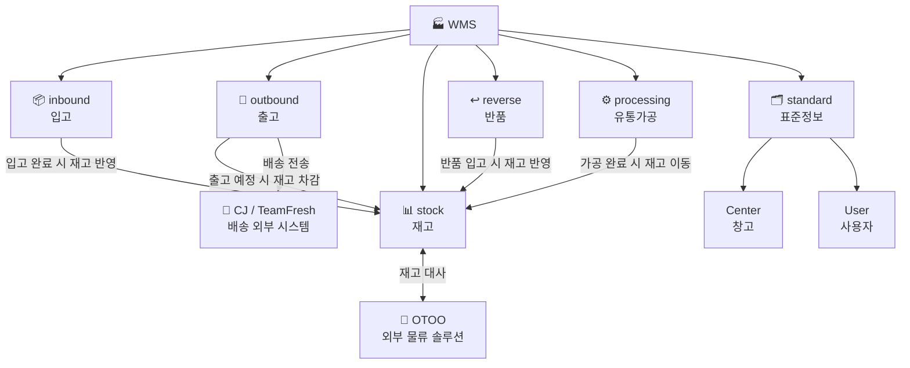
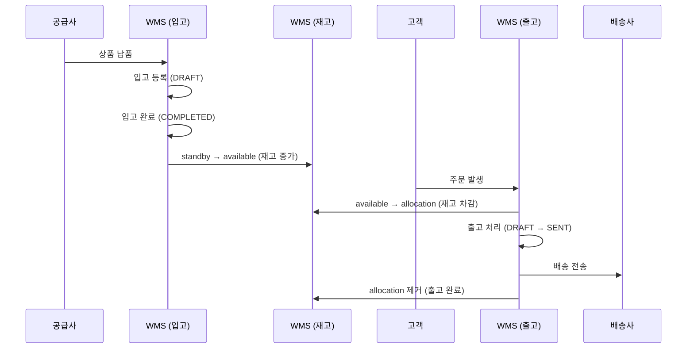
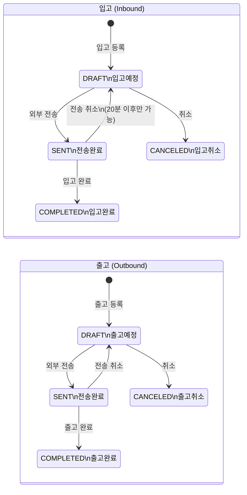
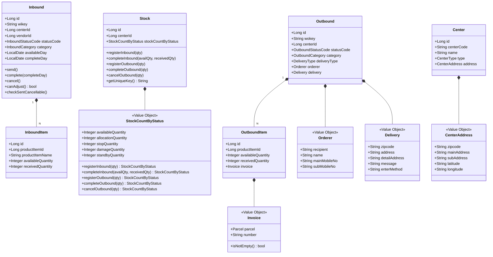
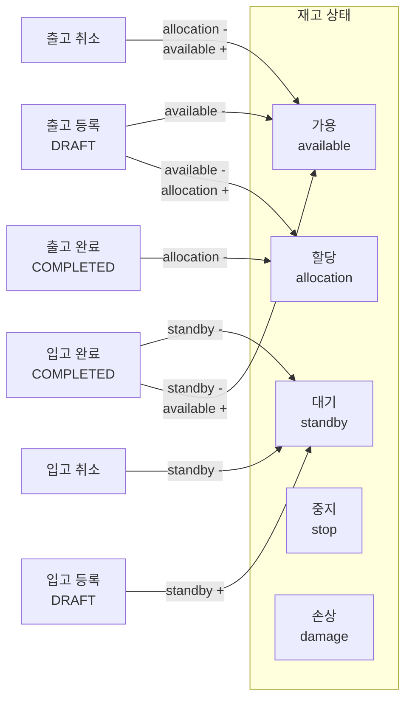
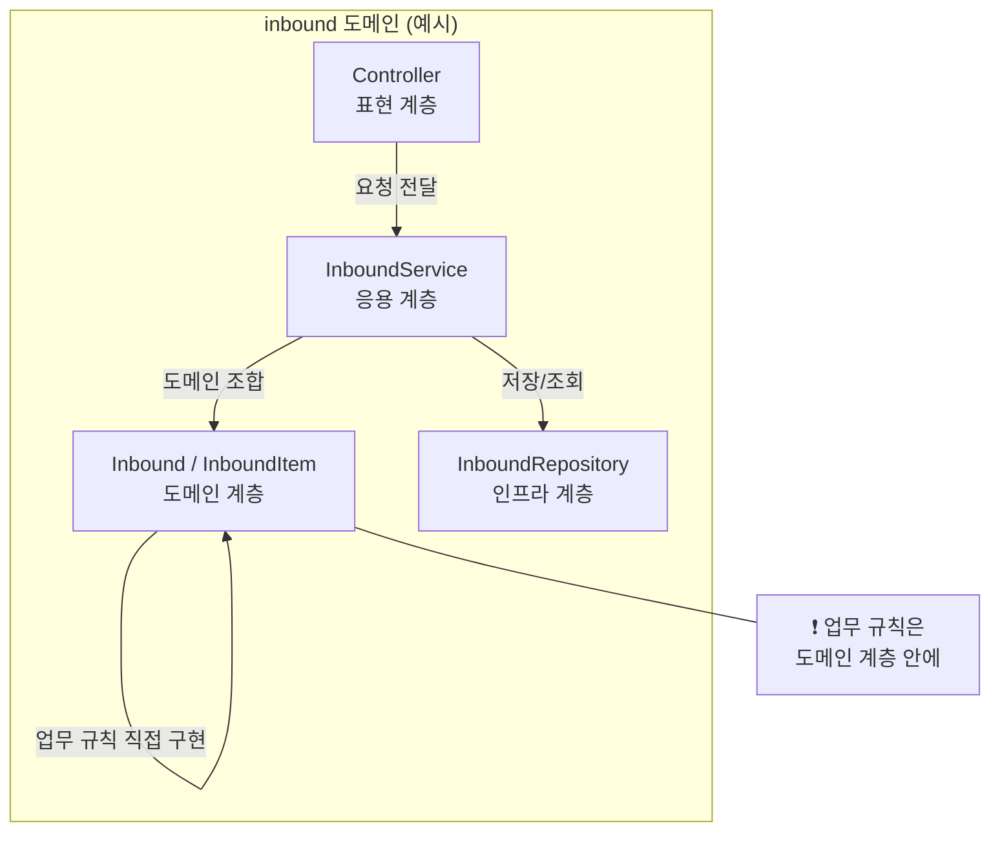

# WMS — 도메인 다이어그램

---

## 1. 하위 도메인 구조

```mermaid
graph TD
    WMS["🏭 WMS"]

    WMS --> IB["📦 inbound\n입고"]
    WMS --> OB["🚚 outbound\n출고"]
    WMS --> ST["📊 stock\n재고"]
    WMS --> RV["↩️ reverse\n반품"]
    WMS --> PR["⚙️ processing\n유통가공"]
    WMS --> SD["🗂️ standard\n표준정보"]

    IB -->|"입고 완료 시 재고 반영"| ST
    OB -->|"출고 예정 시 재고 차감"| ST
    RV -->|"반품 입고 시 재고 반영"| ST
    PR -->|"가공 완료 시 재고 이동"| ST

    SD --> CENTER["Center\n창고"]
    SD --> USER["User\n사용자"]

    EXT1["🚛 CJ / TeamFresh\n배송 외부 시스템"]
    EXT2["📡 OTOO\n외부 물류 솔루션"]

    OB -->|"배송 전송"| EXT1
    ST <-->|"재고 대사"| EXT2
```

---

## 2. 비즈니스 흐름

```mermaid
sequenceDiagram
    participant 공급사
    participant WMS_IB as WMS (입고)
    participant WMS_ST as WMS (재고)
    participant 고객
    participant WMS_OB as WMS (출고)
    participant 배송사

    공급사->>WMS_IB: 상품 납품
    WMS_IB->>WMS_IB: 입고 등록 (DRAFT)
    WMS_IB->>WMS_IB: 입고 완료 (COMPLETED)
    WMS_IB->>WMS_ST: standby → available (재고 증가)

    고객->>WMS_OB: 주문 발생
    WMS_OB->>WMS_ST: available → allocation (재고 차감)
    WMS_OB->>WMS_OB: 출고 처리 (DRAFT → SENT)
    WMS_OB->>배송사: 배송 전송
    WMS_OB->>WMS_ST: allocation 제거 (출고 완료)
```

---

## 3. 입고·출고 상태 전이

```mermaid
stateDiagram-v2
    direction LR

    state "입고 (Inbound)" as IB {
        [*] --> DRAFT_IB : 입고 등록
        DRAFT_IB --> SENT_IB : 외부 전송
        SENT_IB --> DRAFT_IB : 전송 취소\n(20분 이후만 가능)
        SENT_IB --> COMPLETED_IB : 입고 완료
        DRAFT_IB --> CANCELED_IB : 취소

        DRAFT_IB : DRAFT\n입고예정
        SENT_IB : SENT\n전송완료
        COMPLETED_IB : COMPLETED\n입고완료
        CANCELED_IB : CANCELED\n입고취소
    }

    state "출고 (Outbound)" as OB {
        [*] --> DRAFT_OB : 출고 등록
        DRAFT_OB --> SENT_OB : 외부 전송
        SENT_OB --> DRAFT_OB : 전송 취소
        SENT_OB --> COMPLETED_OB : 출고 완료
        DRAFT_OB --> CANCELED_OB : 취소

        DRAFT_OB : DRAFT\n출고예정
        SENT_OB : SENT\n전송완료
        COMPLETED_OB : COMPLETED\n출고완료
        CANCELED_OB : CANCELED\n출고취소
    }
```

---

## 4. 엔티티 & 밸류 클래스 다이어그램

```mermaid
classDiagram
    direction TB

    class Inbound {
        +Long id
        +String wikey
        +Long centerId
        +Long vendorId
        +InboundStatusCode statusCode
        +InboundCategory category
        +LocalDate availableDay
        +LocalDate completeDay
        +send()
        +complete(completeDay)
        +cancel()
        +canAdjust() bool
        +checkSentCancellable()
    }

    class InboundItem {
        +Long id
        +Long productItemId
        +String productItemName
        +Integer availableQuantity
        +Integer receivedQuantity
    }

    class Outbound {
        +Long id
        +String wokey
        +Long centerId
        +OutboundStatusCode statusCode
        +OutboundCategory category
        +DeliveryType deliveryType
        +Orderer orderer
        +Delivery delivery
    }

    class OutboundItem {
        +Long id
        +Long productItemId
        +Integer availableQuantity
        +Integer receivedQuantity
        +Invoice invoice
    }

    class Stock {
        +Long id
        +Long centerId
        +StockCountByStatus stockCountByStatus
        +registerInbound(qty)
        +completeInbound(availQty, receivedQty)
        +registerOutbound(qty)
        +completeOutbound(qty)
        +cancelOutbound(qty)
        +getUniqueKey() String
    }

    class StockCountByStatus {
        <<Value Object>>
        +Integer availableQuantity
        +Integer allocationQuantity
        +Integer stopQuantity
        +Integer damageQuantity
        +Integer standbyQuantity
        +registerInbound(qty) StockCountByStatus
        +completeInbound(availQty, receivedQty) StockCountByStatus
        +registerOutbound(qty) StockCountByStatus
        +completeOutbound(qty) StockCountByStatus
        +cancelOutbound(qty) StockCountByStatus
    }

    class Orderer {
        <<Value Object>>
        +String recipient
        +String name
        +String mainMobileNo
        +String subMobileNo
    }

    class Delivery {
        <<Value Object>>
        +String zipcode
        +String address
        +String detailAddress
        +String message
        +String enterMethod
    }

    class Invoice {
        <<Value Object>>
        +Parcel parcel
        +String number
        +isNotEmpty() bool
    }

    class Center {
        +Long id
        +String centerCode
        +String name
        +CenterType type
        +CenterAddress address
    }

    class CenterAddress {
        <<Value Object>>
        +String zipcode
        +String mainAddress
        +String subAddress
        +String latitude
        +String longitude
    }

    Inbound "1" *-- "N" InboundItem
    Outbound "1" *-- "N" OutboundItem
    Outbound *-- Orderer
    Outbound *-- Delivery
    OutboundItem *-- Invoice
    Stock *-- StockCountByStatus
    Center *-- CenterAddress
```

---

## 5. 재고(Stock) 상태 변화 흐름

```mermaid
graph LR
    subgraph 재고 상태
        AV["가용\navailable"]
        AL["할당\nallocation"]
        SB["대기\nstandby"]
        ST["중지\nstop"]
        DM["손상\ndamage"]
    end

    IB_REG["입고 등록\nDRAFT"] -->|"standby +"| SB
    IB_DONE["입고 완료\nCOMPLETED"] -->|"standby -\navailable +"| AV
    IB_DONE -->|"standby -"| SB
    IB_CANCEL["입고 취소"] -->|"standby -"| SB

    OB_REG["출고 등록\nDRAFT"] -->|"available -\nallocation +"| AL
    OB_REG -->|"available -"| AV
    OB_DONE["출고 완료\nCOMPLETED"] -->|"allocation -"| AL
    OB_CANCEL["출고 취소"] -->|"allocation -\navailable +"| AV
```

---

## 6. 4계층 아키텍처 — 도메인별 패키지 구조

```mermaid
graph TD
    subgraph "inbound 도메인 (예시)"
        CTRL["Controller\n표현 계층"]
        SVC["InboundService\n응용 계층"]
        ENT["Inbound / InboundItem\n도메인 계층"]
        REPO["InboundRepository\n인프라 계층"]
    end

    CTRL -->|"요청 전달"| SVC
    SVC -->|"도메인 조합"| ENT
    SVC -->|"저장/조회"| REPO
    ENT -->|"업무 규칙 직접 구현"| ENT

    note1["❗ 업무 규칙은\n도메인 계층 안에"]
    ENT --- note1
```
