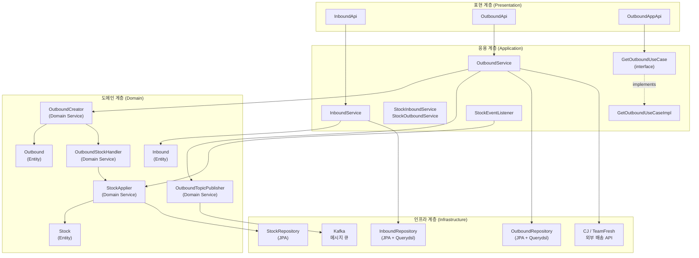
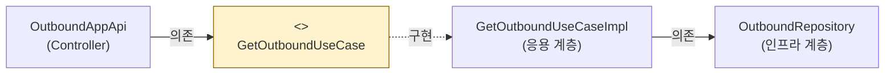
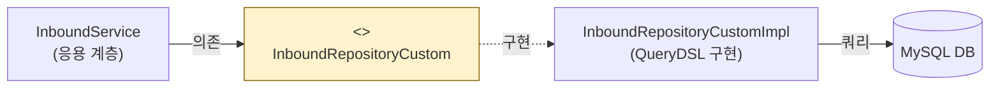
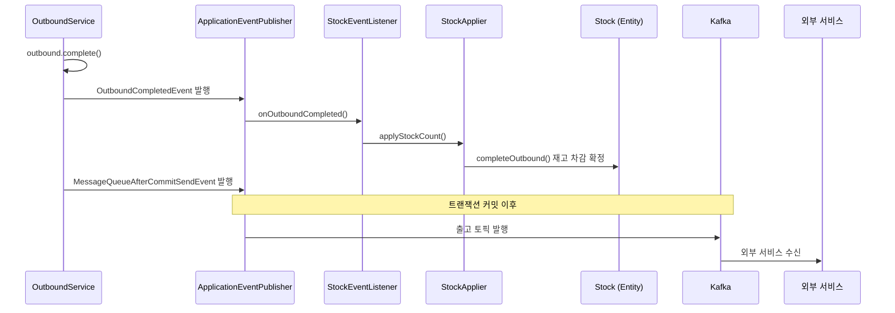
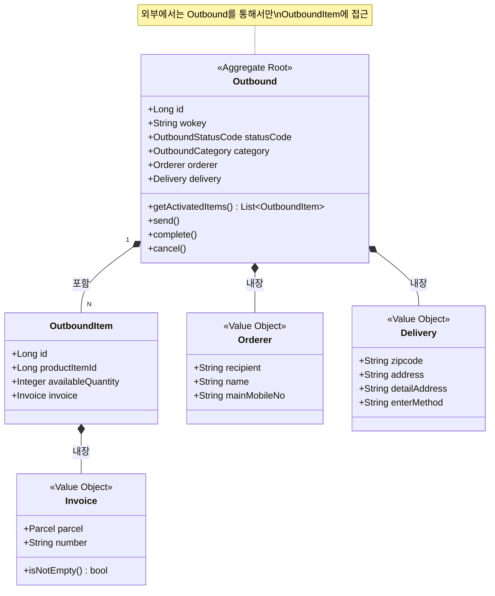
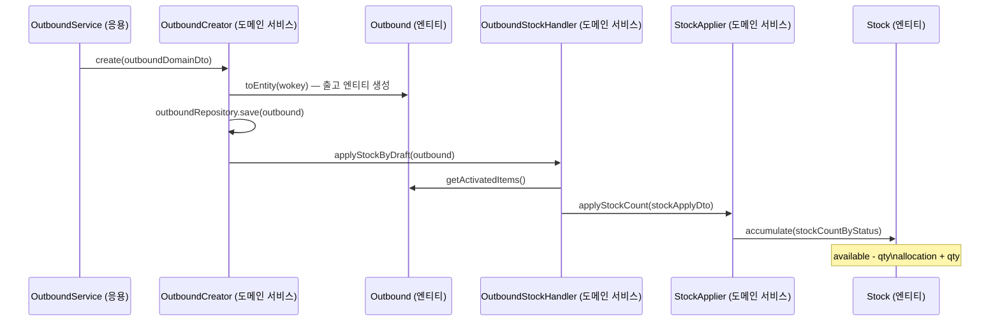
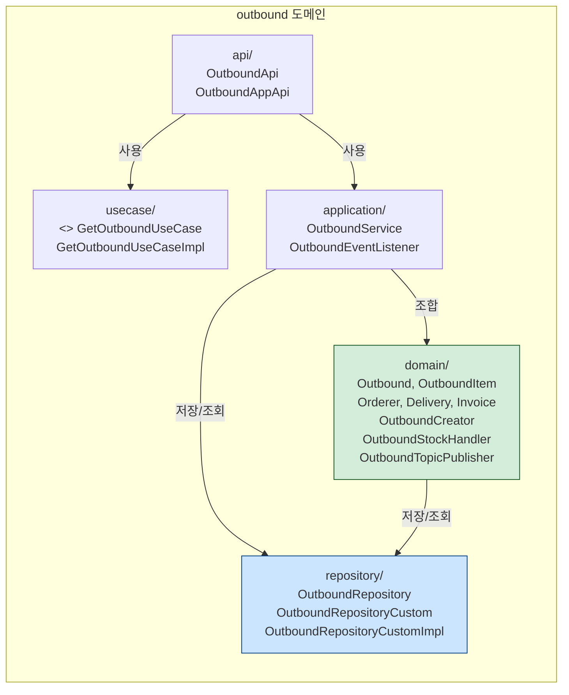

# WMS — Chapter 2 아키텍처 다이어그램

---

## 1. 4계층 아키텍처 — WMS 전체 구조

---

## 2. DIP — UseCase 패턴

Controller는 인터페이스만 알고, 구현체가 바뀌어도 영향받지 않습니다.

---

## 3. DIP — Repository Custom 패턴

---

## 4. 이벤트 기반 도메인 간 협력

---

## 5. Outbound 애그리거트 구조

---

## 6. 출고 생성 흐름 — OutboundCreator 도메인 서비스

---

## 7. 패키지 구조 — 계층별 의존 방향

> 도메인 계층(녹색)이 핵심. 인프라 계층(파란색)은 도메인을 지원하는 역할.
