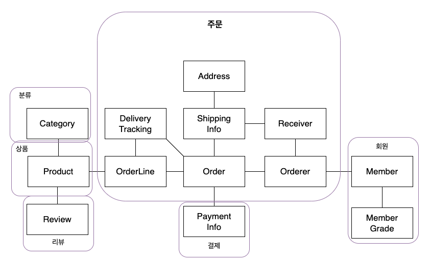
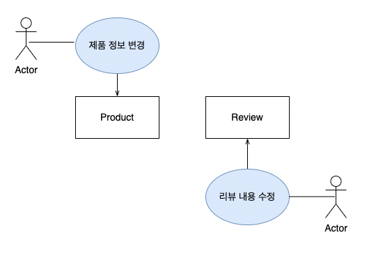
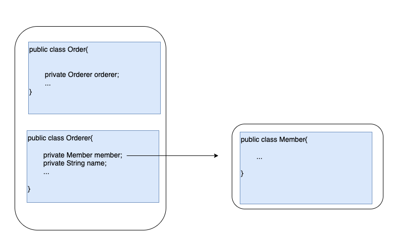
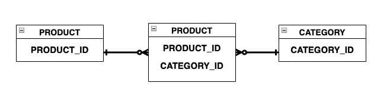

# Chapter 3. 애그리거트
---

## 목차

1. [애그리거트](#31-애그리거트)
2. [애그리거트 루트](#32-애그리거트-루트)
3. [리포지터리와 애그리거트](#33-리포지터리와-애그리거트)
4. [ID를 이용한 애그리거트 참조](#34-id를-이용한-애그리거트-참조)
5. [애그리거트 간 집합 연관](#35-애그리거트-간-집합-연관)
6. [애그리거트를 팩토리로 사용하기](#36-애그리거트를-팩토리로-사용하기)

---

## 3.1 애그리거트

복잡한 도메인을 개별 객체 단위로 보면 전체 구조를 파악하기 어렵습니다. **애그리거트**는 연관된 객체를 하나의 군으로 묶어 상위 수준에서 도메인 간 관계를 볼 수 있게 합니다. 단순히 이해를 돕는 것뿐 아니라 **일관성 관리의 기준**이 됩니다.



**경계 설정 기준:**
- 함께 생성·변경되는 객체를 같은 애그리거트로 묶습니다.
- 한 불변 조건(invariant)을 함께 지켜야 하는 객체들이 한 애그리거트입니다.
- 연관이 있다고 같은 애그리거트가 되는 건 아닙니다. `Product`와 `Review`는 함께 생성·변경되지 않고 변경 주체도 달라서 별도 애그리거트입니다.



---

## 3.2 애그리거트 루트

애그리거트는 **루트 엔티티** 하나를 갖습니다. 루트의 핵심 역할은 **애그리거트 전체의 일관성 유지**입니다.

### 도메인 규칙과 일관성

외부에서 하위 객체를 직접 수정하면 루트가 규칙을 강제할 수 없습니다.

```java
// ❌ 외부에서 직접 수정 — 주문 상태 검증 없이 배송지가 바뀜
order.getShippingInfo().setAddress(newAddress);

// ✅ 루트 메서드 — 검증 + 변경이 함께
public void changeShippingInfo(ShippingInfo newShippingInfo) {
    verifyNotYetShipped();
    this.shippingInfo = newShippingInfo;
}
```

같은 검증 로직을 응용 서비스에 직접 두면 여러 서비스에 중복이 생기고 유지보수가 어려워집니다.

**두 가지 실천 원칙:**
1. **public setter 금지** — 필드에 값을 단순 할당하는 setter는 도메인 의도를 드러내지 못하고 로직을 분산시킵니다.
2. **밸류는 불변** — 불변 밸류는 외부에서 내부 상태를 바꿀 수 없으므로 루트를 통해서만 교체할 수 있습니다.

### 루트의 기능 구현

루트는 내부 객체들에 기능 실행을 위임합니다. `Order`가 총 금액을 구할 때 `OrderLine` 목록을 이용하거나, `Member`가 비밀번호 변경 시 `Password` 객체에 검증을 위임하는 식입니다.

내부의 `OrderLines`를 외부에 노출하면 루트를 우회해 상태를 바꿀 수 있으므로, 내부 컬렉션은 불변으로 구현해 외부 수정을 차단해야 합니다.

### 트랜잭션 범위

루트가 기능을 올바르게 구현했더라도, 한 트랜잭션에서 여러 애그리거트를 건드리면 문제가 생깁니다.

**한 트랜잭션에서는 한 개의 애그리거트만 수정합니다.** 잠금 대상이 늘수록 동시 처리량이 떨어지기 때문입니다. 애그리거트가 다른 애그리거트를 내부에서 직접 수정하면 결합도가 높아지고 트랜잭션 범위가 예측하기 어려워집니다.

부득이하게 두 개 이상을 수정해야 한다면 **응용 서비스에서 각각 수정**합니다. 도메인 이벤트를 활용하면 한 트랜잭션은 한 애그리거트만 수정하면서 다른 애그리거트를 비동기로 변경할 수 있습니다 (10장에서 다룹니다).

예외적으로 팀 표준, 기술 제약, UI 편의(여러 주문을 한 번에 상태 변경) 때문에 한 트랜잭션에서 복수 애그리거트를 수정하기도 합니다.

---

## 3.3 리포지터리와 애그리거트

**리포지터리는 애그리거트 단위로 존재합니다.** `Order`와 `OrderLine`이 별도 테이블에 저장되더라도 `OrderLine` 전용 리포지터리는 만들지 않습니다. `Order` 리포지터리 하나가 애그리거트 전체를 영속화·복원할 책임을 집니다.

기본 메서드는 `save`(저장)와 `findById`(조회) 두 가지입니다. 리포지터리가 반환하는 애그리거트는 완전한 상태여야 합니다. 일부 구성요소가 빠진 불완전한 애그리거트를 반환하면 기능 실행 중 `NullPointerException` 같은 문제가 생깁니다.

---

## 3.4 ID를 이용한 애그리거트 참조

애그리거트가 다른 애그리거트를 **직접 객체 참조**하면 세 가지 문제가 생깁니다.

1. **편한 탐색 오용** — 참조가 있으면 다른 애그리거트 상태를 수정하고 싶은 유혹에 빠지기 쉽습니다.
2. **성능 고민** — LAZY/EAGER 로딩 전략을 매번 고민해야 합니다.
3. **확장 어려움** — 도메인별로 다른 DB나 MSA로 분리할 때 직접 참조는 걸림돌이 됩니다.

**ID 참조**는 이 세 문제를 모두 완화합니다. 다른 애그리거트가 필요하면 응용 서비스에서 ID로 별도 조회합니다.



### N+1 문제

ID 참조를 쓰면 결합도 문제는 해결되지만, 조회 성능 문제가 새로 생깁니다. ID 참조는 지연 로딩과 같은 효과를 내므로 주문 목록을 보여줄 때 주문마다 상품을 조회하는 N+1 문제가 생길 수 있습니다.

해결책은 **조회 전용 DAO**에서 JPQL 조인으로 한 번에 데이터를 가져오는 것입니다.

```java
// 조회 전용 DAO — 조인 쿼리로 N+1 방지
String jpql =
    "select new com.myshop.order.dto.OrderView(o, m, p) " +
    "from Order o join o.orderLines ol, Member m, Product p " +
    "where o.orderer.memberId.id = :ordererId " +
    "and o.orderer.memberId = m.id " +
    "and index(ol) = 0 " +
    "and ol.productId = p.id " +
    "order by o.number.number desc";
```

애그리거트마다 다른 저장소를 쓴다면 캐시나 조회 전용 저장소(CQRS)를 활용합니다.

---

## 3.5 애그리거트 간 집합 연관

개념 모델에 있는 1-N, M-N 연관을 코드에 그대로 반영하면 성능 문제가 생깁니다. 실제 구현에서는 **요구사항에 맞게 연관 방향과 범위를 조정**해야 합니다.

### 1-N 연관

카테고리 → 상품처럼 1-N 연관이 개념적으로 존재해도 실제 구현에 반영하지 않는 경우가 많습니다. `Category`가 `Set<Product>`를 들고 있으면 페이징 조회 시 전체 상품을 로딩하는 성능 문제가 생깁니다. 대신 **N 쪽(Product)에서 1 쪽(Category)을 ID로 참조**하고 리포지터리에서 조건 조회합니다.

### M-N 연관

상품이 여러 카테고리에 속하는 M-N 관계도 마찬가지입니다. 개념적으로는 양방향이지만 실제로는 **단방향만 구현해도 충분**한 경우가 많습니다. 상품 **목록** 화면에서는 각 상품이 속한 모든 카테고리를 표시하지 않고, 카테고리 정보가 필요한 건 상품 **상세** 화면뿐입니다. 따라서 `Product → CategoryId` 방향의 단방향만 구현하면 됩니다.

RDBMS에서는 조인 테이블 + `@ElementCollection`으로 구현합니다.

```java
@ElementCollection
@CollectionTable(name = "product_category",
        joinColumns = @JoinColumn(name = "product_id"))
private Set<CategoryId> categoryIds;
```



---

## 3.6 애그리거트를 팩토리로 사용하기

애그리거트가 **다른 애그리거트를 생성하는 팩토리** 역할을 하면 생성 규칙이 도메인 안에 남습니다.

```java
// ❌ 응용 서비스에서 판단 — 도메인 규칙이 서비스로 흘러나옴
if (store.isBlocked()) throw new StoreBlockedException();
Product product = new Product(...);

// ✅ Store가 팩토리 — 생성 권한 검증이 도메인 안에
public Product createProduct(ProductId id, ...) {
    if (isBlocked()) throw new StoreBlockedException();
    return new Product(id, getId(), ...);
}
```

`Store` 데이터를 이용해 `Product`를 만들고 조건도 `Store`가 직접 판단합니다. 생성 규칙이 바뀌어도 `Store`만 수정하면 됩니다. 생성 로직이 복잡하다면 외부 팩토리(`ProductFactory.create(...)`)에 위임하면서도 차단 여부 판단은 `Store` 안에 유지할 수 있습니다.

---

## 토론 주제

### 💬 Topic 1. 이벤트로 분리한다고 다 해결되는가? — 결과적 일관성의 불편한 진실

책은 "한 트랜잭션 = 한 애그리거트"를 지키되, 다른 애그리거트는 이벤트로 분리하라고 합니다. 원칙은 맞지만 이벤트 기반 설계는 새로운 복잡도를 가져옵니다. 이벤트 발행 후 소비 실패, 멱등성 보장, 보상 트랜잭션 — 직접 구현해보면 "그냥 한 트랜잭션에서 처리할걸" 싶어지는 순간이 옵니다.

**같이 생각해볼 것:**
- 이벤트로 분리했다가 실패 처리나 순서 보장 때문에 더 복잡해진 경험이 있는가?
- 결과적 일관성(eventual consistency)을 사용자나 기획자에게 어떻게 납득시켰는가?
- 어떤 기준으로 "이건 이벤트로", "이건 한 트랜잭션으로" 결정하는가?

---

### 💬 Topic 2. 애그리거트 경계를 잘못 잡으면 — 실제로 어떤 고통이 왔는가?

경계를 너무 크게 잡으면 락 경합·불필요한 로딩, 너무 작게 잡으면 서비스 레이어가 비대해지고 일관성 보장 위치가 모호해집니다. 초기 설계가 틀려서 뜯어고친 경험이 한 번쯤은 있을 겁니다.

**같이 생각해볼 것:**
- 경계를 잘못 잡았다는 걸 어떤 신호로 알아챘는가? (서비스가 비대해짐? 락 경합? 불필요한 로딩?)
- 운영 중 경계를 바꾸려면 실제로 어떤 비용이 드는가?
- ID 참조로 설계해두면 MSA 분리가 수월해진다고 하는데, 실제로 그 전환을 경험해봤는가?