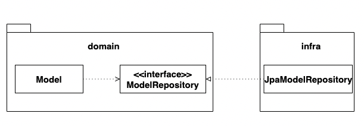
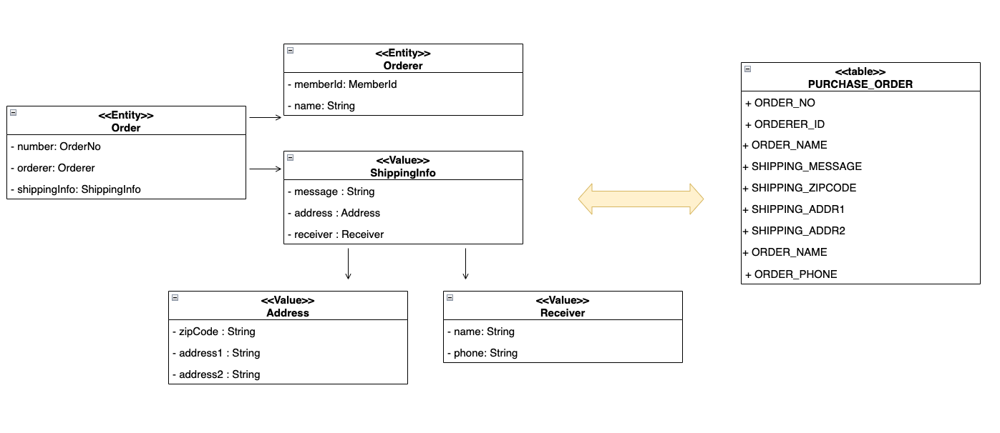
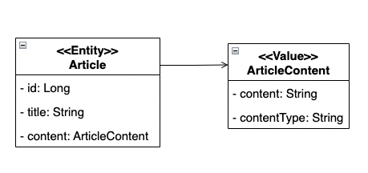
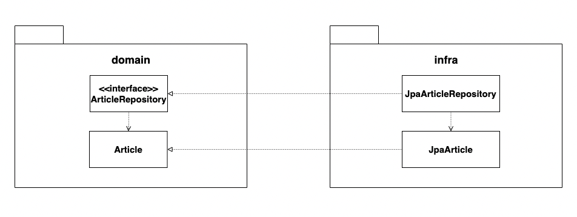

# Chapter 4. 리포지터리와 모델 구현
---

## 목차
1. [JPA 리포지터리 구현](#41-jpa-리포지터리-구현)
2. [스프링 데이터 JPA](#42-스프링-데이터-jpa)
3. [매핑 구현](#43-매핑-구현)
4. [애그리거트 로딩 전략](#44-애그리거트-로딩-전략)
5. [영속성 전파](#45-영속성-전파)
6. [식별자 생성](#46-식별자-생성)
7. [도메인 구현과 DIP](#47-도메인-구현과-dip)

---

## 4.1 JPA 리포지터리 구현

리포지터리 **인터페이스**는 도메인 영역에, **구현체**는 인프라 영역에 둡니다. 이렇게 하면 응용/도메인 계층이 인프라 구현에 직접 의존하지 않습니다.



핵심 기능은 **ID 조회**와 **저장** 두 가지입니다. 트랜잭션 범위 안에서 변경된 엔티티는 `save()` 없이도 커밋 시 자동으로 DB에 반영됩니다 (dirty checking).

```java
public interface OrderRepository {
    Order findById(OrderNo no);
    void save(Order order);
}
```

---

## 4.2 스프링 데이터 JPA

`JpaRepository`를 상속하면 기본 CRUD 구현체가 자동 생성됩니다. 메서드 이름 규칙만 지키면 `findByOrdererMemberId()` 같은 조회 메서드도 별도 구현 없이 동작합니다. 복잡한 조회는 `@Query` + JPQL 또는 QueryDSL을 사용합니다.

---

## 4.3 매핑 구현



**엔티티와 밸류**는 `@Entity` / `@Embeddable` + `@Embedded`로 구분합니다. 밸류는 별도 테이블 없이 엔티티 테이블에 flat하게 저장됩니다.

### 기본 생성자

JPA가 객체를 생성할 때 기본 생성자가 필요하지만, 외부에서 빈 객체를 만드는 건 막아야 합니다. `protected`로 선언하는 것이 관례입니다.

```java
@Embeddable
public class Receiver {
    protected Receiver() {}  // JPA 전용, 외부 사용 금지
    public Receiver(String name, String phone) { ... }
}
```

### 필드 접근 방식

JPA는 프로퍼티(getter/setter) 방식과 필드 방식 두 가지로 매핑할 수 있습니다. 프로퍼티 방식을 쓰면 JPA 때문에 `public setter`를 추가해야 하고, 이는 도메인 캡슐화를 깨는 원인이 됩니다. **필드 접근 방식(`@Access(AccessType.FIELD)`)**을 쓰면 불필요한 getter/setter 없이 도메인 기능 중심으로 엔티티를 구현할 수 있습니다.

### AttributeConverter

`Money` 같은 밸류 타입을 단일 컬럼에 저장할 때 사용합니다. `autoApply = true`로 설정하면 해당 타입이 있는 모든 필드에 자동 적용됩니다.

```java
@Converter(autoApply = true)
public class MoneyConverter implements AttributeConverter<Money, Integer> { ... }
```

### 밸류 컬렉션: 별도 테이블 매핑

`@ElementCollection` + `@CollectionTable`로 별도 테이블에 매핑합니다. `@OrderColumn`으로 순서 인덱스 컬럼을 지정합니다.

### 밸류 컬렉션: 한 개 컬럼 매핑

이메일 주소 목록처럼 컬렉션을 콤마 구분 문자열로 단일 컬럼에 저장할 때는 `AttributeConverter`를 함께 씁니다. 먼저 컬렉션을 감싸는 밸류 타입(`EmailSet`)을 만들고, 해당 타입을 변환하는 Converter를 구현합니다.

### 밸류를 이용한 ID 매핑

식별자에 의미를 부여할 때 밸류 타입으로 만들고 `@EmbeddedId`를 씁니다. 이때 식별자 클래스는 반드시 `Serializable`을 구현해야 합니다.

### 별도 테이블에 저장하는 밸류 매핑

밸류를 별도 테이블에 저장해야 하는 경우 `@SecondaryTable` + `@AttributeOverride`를 씁니다. 테이블은 나뉘지만 객체는 하나이므로 조회 시 자동으로 조인됩니다. PK가 있다고 해서 엔티티가 아닙니다 — 독자적인 라이프사이클이 없으면 밸류입니다.



### 밸류 컬렉션을 @Entity로 매핑하기

밸류인데 상속 구조가 필요해 `@Entity`로 매핑해야 하는 경우, `cascade + orphanRemoval`로 루트와 생명주기를 맞춥니다. 단, `clear()` 호출 시 `@Entity` 컬렉션은 select 후 delete가 발생해 성능 문제가 생깁니다. 이를 피하려면 상속을 포기하고 `@Embeddable` 단일 클래스로 구현하고 타입 컬럼으로 분기합니다.

### ID 참조와 조인 테이블을 이용한 단방향 M-N 매핑

애그리거트 간 M-N 연관을 ID 참조 방식으로 구현할 때, `@ElementCollection`으로 식별자 컬렉션을 매핑합니다. 직접 참조 방식과 달리 영속성 전파나 로딩 전략을 고민할 필요가 없습니다.

---

## 4.4 애그리거트 로딩 전략

EAGER는 항상 함께 로딩하므로 두 컬렉션에 적용하면 **카타시안 조인**이 발생해 중복 데이터가 급증합니다. LAZY는 필요한 시점에만 쿼리가 나가지만 트랜잭션 밖에서 접근하면 `LazyInitializationException`이 납니다.

애그리거트가 완전해야 하는 이유는 두 가지입니다. **상태 변경** 시 완전한 애그리거트가 필요한 것, 그리고 **화면 표시**를 위한 것. 이 중 화면 표시는 별도 조회 모델로 분리하는 게 더 적합합니다. 따라서 로딩 전략 고민은 주로 **상태 변경**에만 집중하면 됩니다. LAZY + 트랜잭션 범위 내 로딩으로도 충분히 처리할 수 있습니다.

---

## 4.5 영속성 전파

`@Embeddable` 밸류는 cascade 설정 없이도 루트와 함께 저장/삭제됩니다. `@Entity`로 매핑된 하위 엔티티는 `cascade = ALL` + `orphanRemoval = true`를 명시해야 루트와 생명주기가 맞습니다.

---

## 4.6 식별자 생성

식별자 생성 방식은 세 가지입니다. 사용자가 직접 입력하거나, 도메인 서비스로 날짜+시퀀스를 조합하거나, DB auto_increment를 씁니다.

생성 규칙이 있다면 **도메인 서비스**(`ProductIdService`)에 위치시키거나, 리포지터리 인터페이스에 `nextId()` 메서드를 추가합니다. `IDENTITY` 전략은 `insert` 이후에야 ID가 확정되므로, 저장 전에 ID가 필요한 로직은 주의해야 합니다.

---

## 4.7 도메인 구현과 DIP

`@Entity`, `@Table` 같은 JPA 어노테이션이 도메인 클래스에 직접 붙으면 엄밀히 DIP 위반입니다. 완벽하게 분리하면 클래스 수가 2배가 되고 변환 코드가 생깁니다.



> **저자의 결론:** 리포지터리와 도메인 구현 기술은 거의 바뀌지 않으므로, 완벽한 DIP보다 **개발 편의성과 실용성**을 우선합니다.

---

## 토론 주제

### 💬 Topic 1. LAZY + OSIV — 편의를 위한 선택이 어디까지 허용되는가?

Spring Boot의 `spring.jpa.open-in-view` 기본값은 `true`입니다. OSIV를 켜두면 View나 Controller에서도 LAZY 로딩이 가능해져 `LazyInitializationException`을 피할 수 있습니다. 하지만 트랜잭션이 끝난 뒤에도 DB 커넥션을 물고 있어 커넥션 풀 고갈로 이어질 수 있습니다.

**같이 생각해볼 것:**
- OSIV를 끄면 어디서 데이터를 로딩해야 하는가? 서비스 레이어가 두꺼워지는 문제는 어떻게 해결하는가?
- 조회 전용 화면에서 엔티티를 직접 반환하는 것과 별도 DTO 조회 모델을 쓰는 것의 트레이드오프는?
- LAZY를 기본으로 가져가면서 성능을 챙기려면 어떤 패턴이 유효한가?

---

### 💬 Topic 2. 도메인에 JPA 어노테이션이 붙는 것 — 실용이냐 오염이냐?

JPA를 걷어낼 현실적 가능성은 낮지만 기술 의존이 도메인에 스며드는 건 사실입니다. `@Getter`, `@NoArgsConstructor` 같은 Lombok도 같은 시각으로 볼 수 있습니다.

**같이 생각해볼 것:**
- JPA를 교체할 가능성이 없다면 분리의 이득이 비용을 넘는가?
- 어노테이션 외에 도메인이 인프라에 의존하게 되는 더 위험한 사례는 무엇인가?
- Lombok(`@Getter`, `@NoArgsConstructor`)도 같은 기준으로 봐야 하는가?
